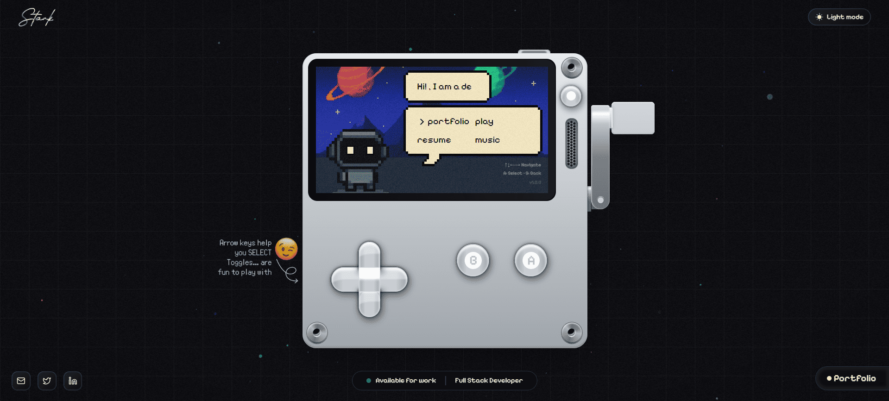

# Stark's Portfolio



A modern, interactive **[developer portfolio](https://next-portfolio-stark.vercel.app)** built with **Next.js 15**, **Prisma**, and **shadcn/ui**

> This portfolio showcases my work, my projects, and my personality

---

## Tech Stack

**Framework & Runtime**
- [Next.js 15](https://nextjs.org/) — UI Framework
- [TypeScript 5](https://www.typescriptlang.org/) — For type safety

**Styling & UI**
- [Tailwind CSS 4](https://tailwindcss.com/) — For Styling
- [shadcn/ui](https://ui.shadcn.com/) — for accessible components
- [Lucide Icons](https://lucide.dev/) — for Icon
- [Framer Motion (motion)](https://motion.dev/) — for animation

**Backend & Data**
- [Prisma ORM 6](https://www.prisma.io/) 
- [Better Auth](https://better-auth.dev/)
- [Zod](https://zod.dev/) — for runtime schema validation
- [Umami](https://umami.is/) — Analytics

**State & Utilities**
- [Zustand](https://github.com/pmndrs/zustand)
- [TanStack Query](https://tanstack.com/query)
- [Day.js](https://day.js.org/)
- [Lodash](https://lodash.com/)

---


## Run Project Locally

### Clone the repository
```bash
git clone https://github.com/NotStark/portfolio.git
cd portfolio
````

### Install dependencies 

```bash
npm install
```

### Set up environment variables

Create a `.env` & copy the variables from `.env.example` file in the root and configure it.

### Generate Prisma Client

```bash
npx prisma generate
```

### Run the development server

```bash
npm run dev
```

> Your portfolio should now be live at **[http://localhost:3000](http://localhost:3000)** 🎉

---

## Deployment

Deployed easily via [Vercel](https://vercel.com/) (recommended).

1. Connect your GitHub repository.
2. Add your environment variables in the Vercel dashboard.
3. Deploy → done!

---

## Connect With Me

| Platform     | Link                                                             |
| ------------ | ---------------------------------------------------------------- |
| 💬 Telegram  | [https://t.me/EternalVortex](https://t.me/EternalVortex)      
| 🐦 Twitter   | [https://twitter.com/NotStark101](https://twitter.com/NotStark101) |         |
| 💻 Discord   | `_notstark`                                            |
              
---


## Star History
**⭐ If you liked this project, give it a star — it helps a lot!**
<picture>
  <source media="(prefers-color-scheme: dark)" srcset="https://api.star-history.com/svg?repos=Notstark/Portfolio&type=Date&theme=dark" />
  <source media="(prefers-color-scheme: light)" srcset="https://api.star-history.com/svg?repos=Notstark/Portfolio&type=Date" />
  
</picture>

